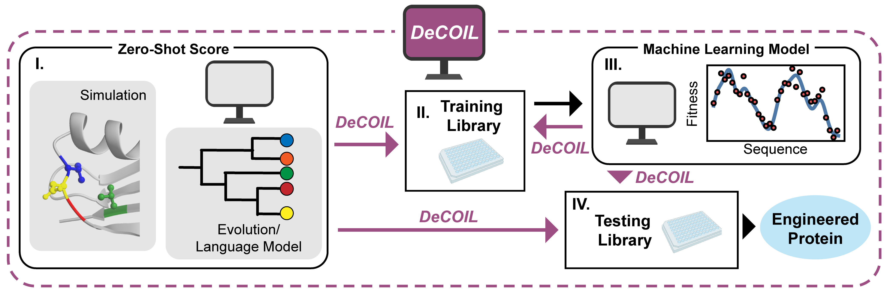

# DeCOIL

DEgnerate Codon Optimization for Informed Libraries (DeCOIL) is a computational method to optimize degenerate codons for synthesizing an informed combinatorial mutagenesis protein variant library, which is a critical step in a variety of machine learning-assisted protein engineering workflows. DeCOIL aims to bias a degenerate library toward desired proteins based on a predictive model from physics-based simulations, evolutionary knowledge, or machine-learning models while also providing diversity in the library.

## Installation
To download, clone this repository
```
git clone https://github.com/jsunn-y/DeCOIL.git
```
To run DeCOIL optimization, the relevant anaconda environment can be installed from `DeCOIL.yml`. To build this environment, run
```
cd ./DeCOIL
conda env create -f DeCOIL.yml
conda activate DeCOIL
```

## General Use
DeCOIL can be executed on a personal computer using the following command:
```
python execute_DeCOIL.py --config_file 'file_name.json'
```
The configuration file should be located in `DeCOIL/configs` with keys specified as follows:
| Key (data config) | Description |
|:-----------|:----------------:|
| name |filname for csv file containing sequences in the combinatorial space and corresponding predicted values. Must contain a column called 'Combo' which sqecifies the mutations at each site in the combinatorial library| 
|zs_name | Name of the column in the csv file, which contains the relative value of each variant. By default, lower values are more desirable.| 
|samples |Approximate screening size (number of sequences sampled from the library)| 
|sites |number of amino acid sites targeted in the combinatoral library|
|library | optional argument. If not provided, optimizes from random initializations. If a string, loads the final libraries from a previous optimization with the same configuration name. If a list of strings, each string in the list should specify a mixed base template to load.|


| Key (train config)| Description |
|:-----------|:----------------:|
| type |type of optimization, only "greedy" is currently supported| 
|weight_type | List containing either "simple" or "full" for step and diffuse coverage respectively. If "full" is specified, the encoding type can also be specified, default is onehot.| 
|dist_function |Only required if weight_type contains "full". Can be "hamming", "manhattan", or "euclidean" | 
| zs_exp |p parameter, which is used to tune the desired amount of exploration and exploitation|
| sigma | $\sigma$ parameter used in diffuse coverage calculations|
| seed | seed for reproducibility|
| iters | number of iterations for greedy hill climbing |
| samples | number of initial starting points and solutions, parallelized|
| n_mix | number of templates per library to optimize simultaneously |
| directions | number of random changes to the library to test in each iteration of greedy hill climbing|
| num_repeats | number of sets of sequences to sample from the library for scoring, to get good statistics|
| num_workers | number of processors to use|
| top_fraction | fraction of sequences in a certain percentile of predictor scores, for logging purposes only|

After each iteration of optimization, average stats for each library will be printed.
Weighted (weighted coverage)
Unweighted (unweighted coverage)
Raw Weighted Simple (weighted step coverage with p=1)
Top Counts: Number of unique variants sampled by the library that lie in "top_fraction"
Unique: Number of unique variants sampled by the library that are not stop codons

Outputs will be saved in `DeCOIL/saved` under a folder with the name as the configuration file. The optimization trajectory can be accessed in `results.npy` and example analyses are provided in `analysis.ipynb`.

## MLDE Simulations
To run MLDE simulations, the relevant anaconda environment can be installed from `MLDE_lite.yml`. To build this environment, run
```
cd ./DeCOIL
conda env create -f MLDE_lite.yml
conda activate MLDE_lite
```
The MLDE simulations demonstrated in our accompanying study can be reproduced below:
```
python execute_mlde.py --config_file 'file_name.json'
```
The configuration file should be located in `MLDE_lite/configs` with keys specified as follows:
| Key (data config)| Description |
|:-----------|:----------------:|
| name |filname for csv file containing sequences in the combinatorial space and corresponding fitness values. Use "GB1_fitness.csv" for the GB1 dataset| 
|encoding | List of encodings to use, only supports "one-hot"| 
|library | Specifies how the training sequences should be sampled for each simulation. If a list of integers is provided, for an integer $a$, sequences will be sampled from the library containing the top $a$ sequences based on the Triad rank. If a string is specified, the optimized degenerate codon libraries corresponding to that folder in `optimization/saved` will be used| 
|n_solutions |must correspond to the number of libraries specified in "library"|

| Key (model config)| Description |
|:-----------|:----------------:|
| name | list of model classes to be used. Only supports "boosting"| 

| Key (train config)| Description |
|:-----------|:----------------:|
| seed | seed for reproducibility| 
| n_samples | list of integers specifying the number of sequences to sample from a library for the training set| 
| n_splits | the number of models to be trained in the ensemble| 
| n_subsets | number of times to sample training sequences from the library, to get statistics| 
| num_workers | number of processors to use| 
| verbose | boolean specifying whether or not to print training updates| 
| save_model | boolean specifying whether or not to save the trained models| 

Outputs will be saved in `MLDE_lite/saved` under a folder with the name as the configuration file. The results of MLDE simulations can be accessed in `mlde_results.npy` and example analyses are provided in `analysis.ipynb`.

## Examples
Relevant examples can be found under `/configs/examples` and `/saved/examples`
